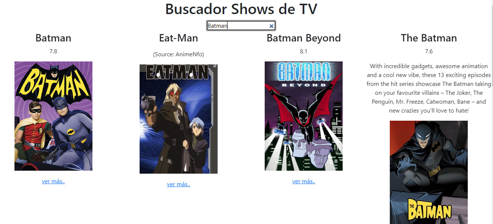

# BUSCADOR DE SHOWS

En este ejercicio se utilizó la API de TVMaze para el uso de un catálogo de televisión. Se uso lo mínimo de CSS ya que no era el fin del ejercicio.

Al buscar el Show se trae la descripción de cada show, su imagen y su puntaje. Estas dos últimas propiedades pueden no verse porque no todos los objetos las tienen.

Además se configuró para que si el show no tiene imagen se le asgine una por defecto, con un link de referencia a la página de TVMaze para ver la información completa.

A continuación una imagen de como queda:

